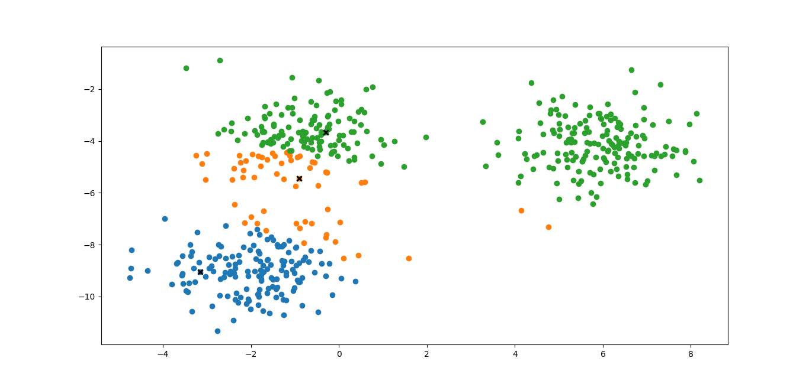
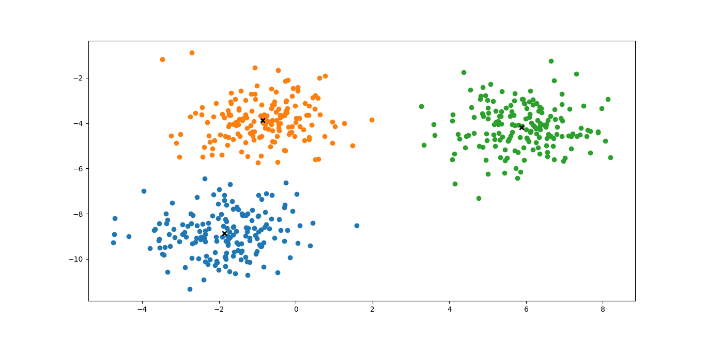

# K-Means Clustering from Scratch

This project implements the **K-Means Clustering** algorithm from scratch using Python. It consists of two main files: `train_test.py` for data generation and visualization, and `kmeans.py` which contains the logic of the K-Means algorithm.

## What is K-Means Clustering?

K-Means is an **unsupervised machine learning** algorithm used for **clustering** data into `k` groups. Each data point is assigned to the cluster with the nearest mean (called the centroid). The algorithm iteratively refines these centroids to minimize the within-cluster variance.

K-Means works in the following steps:

1. Initialize `k` centroids randomly.
2. Assign each data point to the closest centroid (forming `k` clusters).
3. Compute the new centroid of each cluster.
4. Repeat steps 2 and 3 until the centroids no longer change or a set number of iterations is reached.

---

## File: `kmeans.py`

This file contains the implementation of the K-Means algorithm.

### Step-by-step breakdown:

* **Class `KMeans`**: Defines the K-Means model.

  * `__init__(self, k, max_iters=100)`: Initializes number of clusters `k` and maximum iterations.
  * `fit(self, X)`: Trains the model on input data `X`.

    * Randomly selects initial centroids from the dataset.
    * Iteratively assigns each point to the nearest centroid and updates centroids based on current cluster members.
    * Repeats until convergence or max iterations.
  * `predict(self, X)`: Predicts the closest cluster for each point in `X`.
  * `_create_clusters(self, X, centroids)`: Assigns each point to a cluster based on nearest centroid.
  * `_calculate_centroids(self, clusters, X)`: Computes the new centroids from the current clusters.
  * `_is_converged(self, old_centroids, centroids)`: Checks if centroids have stopped changing.

### Comments for better understanding:

* The model is trained without using any libraries like `sklearn` to better understand how K-Means works.
* Uses basic Python and NumPy operations.
* Centroids are tracked over iterations.
* The code handles convergence and avoids infinite loops.

---

## File: `train_test.py`

This file generates synthetic data, trains the K-Means model, and visualizes results.

### Step-by-step breakdown:

1. **Data Generation**:

   * Uses `make_blobs` from `sklearn.datasets` to create 3 clusters of data.
2. **Plot Initial Data (Before K-Means)**:

   * Shows how the data looks before applying the clustering algorithm.
   * Saves this as `clusters_start.png`.
3. **Model Training**:

   * Initializes the KMeans model with `k=3`.
   * Calls `fit()` to cluster the data.
4. **Plot Final Clusters**:

   * Uses predicted labels to color the clusters.
   * Displays the final centroids with an 'X' marker.
   * Saves this as `clusters_end.png`.

---

## Image Explanation

### clusters\_start.png

* This image shows the state of the data after randomly selecting initial centroids.
* Data points are already visually separated, but the cluster labels are poorly assigned.
* There is significant misclassification in the middle and top-right clusters.
* Centroids (marked with a black 'X') are not well-placed initially.

### clusters\_end.png

* This image shows the result after the K-Means algorithm has converged.
* Data points are now well-clustered into three distinct groups.
* Final centroids (black 'X') are at the center of each cluster.
* The model has successfully found natural groupings in the data.

---

## What I Learned

By implementing K-Means Clustering from scratch, I learned:

* The importance of initialization and how it affects convergence.
* How distance metrics (like Euclidean distance) play a central role.
* How to group data into meaningful clusters without labels.
* The entire inner workings of K-Means without relying on external libraries.
* How to visualize clusters and interpret results using matplotlib.

This project helped me develop a deeper understanding of unsupervised learning, algorithm design, and data visualization.

---
