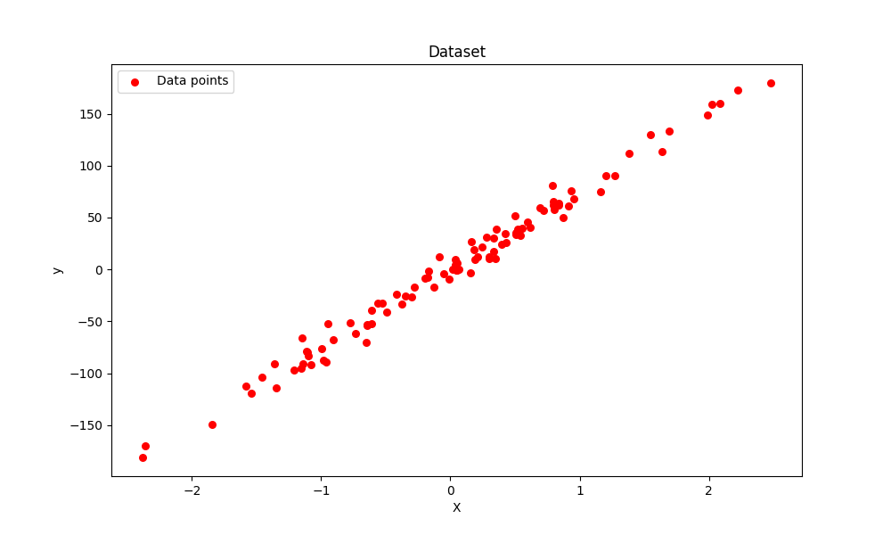
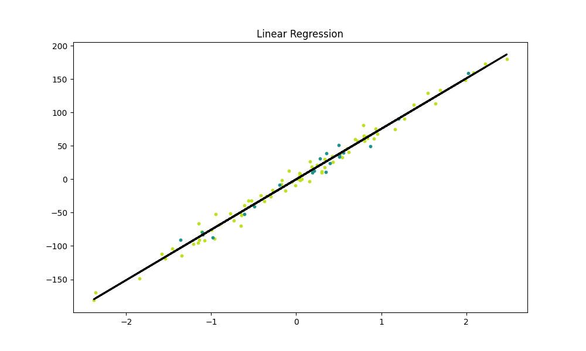

# Linear Regression From Scratch

## What is Linear Regression?

Linear Regression is one of the most fundamental algorithms in machine learning and statistics. It models the relationship between a dependent variable (target) and one or more independent variables (features) by fitting a linear equation to observed data. In the simplest case (with one feature), it draws a straight line that best fits the data points.

The general equation of a linear model is:

```
y = w * x + b
```

* `y`: predicted value
* `x`: input feature
* `w`: weight (slope)
* `b`: bias (intercept)

## Project Overview

In this project, I implemented Linear Regression from scratch using Python and NumPy, without using any machine learning libraries like Scikit-learn for the model. This project consists of two files:

* `train.py`: This file loads the dataset, splits it, trains the model, visualizes data, and evaluates performance.
* `Linear_regression.py`: This file contains the implementation of the Linear Regression model including training and prediction logic.

---

## Code Explanation

### `Linear_regression.py`

This file defines a class `LinearRegression` with the following components:

```python
class LinearRegression:
    def __init__(self, lr=0.001, n_iters=1000):
        self.lr = lr
        self.n_iters = n_iters
        self.weights = None
        self.bias = None
```

* Initializes the model with a learning rate and number of iterations.
* `weights` and `bias` are initialized during training.

```python
    def fit(self, X, y):
        n_samples, n_features = X.shape
        self.weights = np.zeros(n_features)
        self.bias = 0
```

* Initializes weights and bias.

```python
        for _ in range(self.n_iters):
            y_pred = np.dot(X, self.weights) + self.bias
            dw = (1/n_samples) * np.dot(X.T, (y_pred - y))
            db = (1/n_samples) * np.sum(y_pred - y)
            self.weights -= self.lr * dw
            self.bias -= self.lr * db
```

* Trains the model using **Gradient Descent** by updating weights and bias to reduce the error.

```python
    def predict(self, X):
        return np.dot(X, self.weights) + self.bias
```

* Predicts output values using learned weights and bias.

---

### `train.py`

This script performs the following tasks:

1. **Data Generation**:

```python
X, y = datasets.make_regression(n_samples=100, n_features=1, noise=10, random_state=4)
```

* Creates a synthetic dataset using `sklearn.datasets`.

2. **Data Splitting**:

```python
X_train, X_test, y_train, y_test = train_test_split(X, y, test_size=0.2, random_state=1234)
```

* Splits the data into training and testing sets.

3. **Visualization - Dataset**:

```python
plt.scatter(X[:, 0], y, color='red')
```

* Plots the raw data before training.

4. **Model Training**:

```python
reg = LinearRegression(lr=0.01)
reg.fit(X_train, y_train)
```

* Initializes and trains the model using the training data.

5. **Prediction and Evaluation**:

```python
predictions = reg.predict(X_test)
```

* Makes predictions on the test data.

6. **Mean Squared Error (MSE)**:

```python
def mse(y_test, predictions):
    return np.mean(y_test - predictions) ** 2
```

* Calculates Mean Squared Error, which measures the average of the squares of the errors.
* Lower MSE means better performance.

7. **Visualization - Prediction with Regression Line**:

```python
plt.plot(X, y_pred_line, color='black')
```

* Plots the regression line on top of training/testing data.

---

## Visualizations Explained

### 1. Dataset Visualization



* This image shows the generated data points. Red dots represent the samples generated using `make_regression()`. These are the true values without any model applied.

### 2. Prediction with Regression Line



* This plot shows:

  * Training data (light color)
  * Testing data (darker color)
  * The regression line (black), which is the line of best fit learned by the model.

---

## What I Learned From This Project

* **How Linear Regression works under the hood**: From defining weights and bias to applying gradient descent.
* **Implemented gradient descent manually** to optimize weights.
* **Evaluated performance** using Mean Squared Error.
* **Visualized data and regression line** for better understanding of model fitting.
* **Gained confidence** in implementing ML models from scratch using NumPy.

This project solidified my understanding of how regression models learn and how gradient descent plays a role in minimizing error to fit a model to data.
