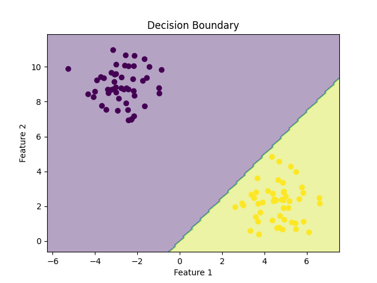

# Perceptron From Scratch

This project demonstrates how to implement a **Perceptron** one of the simplest types of artificial neural networks from scratch using Python and NumPy. It includes code for training the perceptron on a synthetic dataset and visualizing the decision boundary.

---

## What is a Perceptron?

A **Perceptron** is a binary classification algorithm and one of the earliest models of a neural network. It attempts to find a hyperplane that separates data points of two different classes. It updates its weights based on prediction errors and continues this process for several iterations until the model converges or reaches a predefined iteration limit.

---

## Step-by-Step Breakdown of the Files

### File: `perceptron.py`

This file defines the Perceptron class and the training logic:

* Defines a unit step activation function.
* Initializes weights and bias.
* Trains the perceptron using the Perceptron Learning Rule.
* Implements the `fit()` and `predict()` methods.

### File: `train_test.py`

This file handles data generation, training, testing, and visualization:

* Generates a binary classification dataset using `sklearn.datasets.make_blobs()`.
* Splits the dataset into training and testing sets.
* Instantiates the Perceptron and trains it.
* Tests the model and calculates accuracy.
* Plots the decision boundary using `matplotlib`.

---

## Code Walkthrough with Comments

### perceptron.py

```python
import numpy as np

def unit_step_function(x):
    return np.where(x >= 0, 1, 0)  # Binary step function for activation

class Perceptron:
    def __init__(self, learning_rate=0.01, n_iterations=1000):
        self.lr = learning_rate
        self.n_iterations = n_iterations
        self.activation_function = unit_step_function
        self.weights = None
        self.bias = None

    def fit(self, X, y):
        n_samples, n_features = X.shape
        self.weights = np.zeros(n_features)
        self.bias = 0

        y_ = np.where(y > 0, 1, 0)  # Convert labels to binary (0 or 1)

        for _ in range(self.n_iterations):
            for idx, X_i in enumerate(X):
                linear_output = np.dot(X_i, self.weights) + self.bias
                y_predicted = self.activation_function(linear_output)
                update = self.lr * (y_[idx] - y_predicted)
                self.weights += update * X_i
                self.bias += update

    def predict(self, X):
        linear_output = np.dot(X, self.weights) + self.bias
        return self.activation_function(linear_output)
```

### train\_test.py

```python
from sklearn import datasets
from sklearn.model_selection import train_test_split
from perceptron import Perceptron
import numpy as np
import matplotlib.pyplot as plt

# Generate data with two centers
X, y = datasets.make_blobs(n_samples=100, centers=2, random_state=42, cluster_std=1.05)

# Split data into train/test sets
X_train, X_test, y_train, y_test = train_test_split(X, y, test_size=0.2, random_state=42)

# Initialize and train model
perceptron = Perceptron(learning_rate=0.01, n_iterations=1000)
perceptron.fit(X_train, y_train)

# Accuracy calculation
def accuracy(y_true, y_pred):
    return np.sum(y_true == y_pred) / len(y_true)

# Predict and evaluate
y_pred = perceptron.predict(X_test)
acc = accuracy(y_test, y_pred)
print(f"Accuracy: {acc:.2f}")

# Plot decision boundary
def plot_decision_boundary(X, y, model):
    x_min, x_max = X[:, 0].min() - 1, X[:, 0].max() + 1
    y_min, y_max = X[:, 1].min() - 1, X[:, 1].max() + 1
    xx, yy = np.meshgrid(np.arange(x_min, x_max, 0.1), np.arange(y_min, y_max, 0.1))
    Z = model.predict(np.c_[xx.ravel(), yy.ravel()])
    Z = Z.reshape(xx.shape)
    plt.contourf(xx, yy, Z, alpha=0.4)
    plt.scatter(X[:, 0], X[:, 1], c=y, cmap='viridis')
    plt.xlabel('Feature 1')
    plt.ylabel('Feature 2')
    plt.title('Decision Boundary')
    plt.show()

plot_decision_boundary(X, y, perceptron)
```

---

## Prediction Accuracy

The model achieved **Accuracy: 1.00** (100%) on the test set. This means the perceptron correctly classified all points in the test data, which may indicate that the dataset is linearly separable and ideal for a perceptron.

---


## Lessons Learned: Perceptron from Scratch

By implementing the Perceptron algorithm from scratch:

* I learned how binary classification works on linearly separable data.
* I understood how the model updates weights using the Perceptron Learning Rule.
* I gained insight into using NumPy for matrix operations and vectorization.
* I got hands-on experience with building models without using pre-built libraries.
* I improved my debugging and visualization skills.

---

## Decision Boundary Visualization



The decision boundary plot shows a shaded region separated by a contour line, which is the decision boundary learned by the perceptron. All data points on one side of this boundary belong to one class, and all on the other side belong to the second class. This visual confirms the perceptron's ability to learn a linear separator effectively on this dataset.

---

