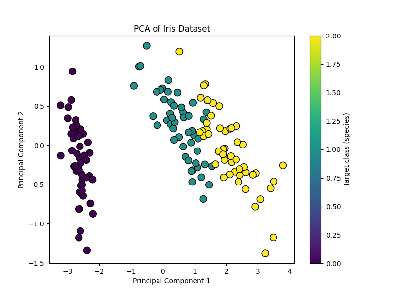

# Implementing PCA (Principal Component Analysis) from Scratch

## What is PCA in Machine Learning?

Principal Component Analysis (PCA) is an **unsupervised machine learning technique** used for **dimensionality reduction**. It transforms a dataset with potentially correlated features into a set of linearly uncorrelated variables called **principal components**. These components capture the directions of maximum variance in the data. The main goals of PCA are:

* Reducing the number of features while retaining most of the information.
* Improving computational efficiency.
* Visualizing high-dimensional data in 2D or 3D.

---

## What I Did in `pca.py` and `train_test.py`

### 1. `pca.py`

This file contains the **PCA class implementation from scratch** using NumPy.

#### Step-by-step Explanation:

* **Initialization**:

  ```python
  def __init__(self, n_components):
      self.n_components = n_components
      self.components_ = None
      self.mean = None
  ```

  We define the number of principal components we want and initialize the mean and principal components.

* **Fit Function**:

  ```python
  def fit(self, X):
      self.mean = np.mean(X, axis=0)
      X = X - self.mean
      covariance_matrix = np.cov(X.T)
      eigenvalues, eigenvectors = np.linalg.eig(covariance_matrix)
      eigenvectors = eigenvectors.T
      sorted_indices = np.argsort(eigenvalues)[::-1]
      eigenvalues = eigenvalues[sorted_indices]
      eigenvectors = eigenvectors[sorted_indices]
      self.components_ = eigenvectors[:self.n_components]
  ```

  * Center the dataset by subtracting the mean.
  * Compute the covariance matrix.
  * Calculate eigenvalues and eigenvectors.
  * Sort them in descending order of eigenvalues.
  * Select the top `n_components` eigenvectors.

* **Transform Function**:

  ```python
  def transform(self, X):
      X = X - self.mean
      return np.dot(X, self.components_.T)
  ```

  * Center the input data.
  * Project the data onto the selected principal components.

### 2. `train_test.py`

This file loads the **Iris dataset** and uses the PCA class from `pca.py` to reduce the feature dimensions from 4 to 2.

#### Step-by-step Explanation:

* Load the Iris dataset using scikit-learn.
* Instantiate the PCA class with `n_components=2`.
* Fit the PCA model to the data.
* Transform the data into 2 principal components.
* Print the shapes of the original and reduced data.
* Plot the transformed data using `matplotlib.pyplot.scatter` and add a color bar indicating species class.

---

### Explanation of the Output Plot:


#### This scatter plot represents the Iris dataset projected onto the top 2 principal components:
* Each point is a flower sample.
* The x-axis is Principal Component 1, and the y-axis is Principal Component 2.
* Colors represent different species (Setosa, Versicolor, Virginica).

#### Insights from the Plot:
* The first component (PC1) captures the most variance.
* Setosa is clearly separable, while Versicolor and Virginica show some overlap.
* This shows that PCA can be used to reduce dimensions while still preserving class separability for visualization.

## Code Comments

### In `pca.py`

* `np.mean(X, axis=0)`: Calculates mean for each feature (column).
* `np.cov(X.T)`: Covariance matrix of features (transposed so features become rows).
* `np.linalg.eig()`: Finds eigenvalues and eigenvectors.
* `np.argsort(eigenvalues)[::-1]`: Sort eigenvalues in descending order.
* `np.dot(X, self.components_.T)`: Project original data into the PCA space.

### In `train_test.py`

* `datasets.load_iris()`: Load Iris dataset (150 samples, 4 features).
* `scatter = plt.scatter(...)`: Plot transformed 2D data with color-coded classes.
* `plt.colorbar(scatter)`: Add a right-side color bar to show class labels.

---

## Data Shape Explanation

* **Original Shape**: `(150, 4)` means we had 150 samples and 4 features (sepal length, sepal width, petal length, petal width).
* **Transformed Shape**: `(150, 2)` means the data is now represented using only the top 2 principal components.

This confirms that PCA successfully reduced the dataset from 4D to 2D while preserving the major structure in the data.

---

## What I Learned from This Project

* I now understand how PCA works **under the hood**, including eigenvalues, eigenvectors, and covariance matrices.
* I practiced implementing a real machine learning algorithm from scratch using only NumPy.
* I learned how to apply PCA to a real dataset like Iris and visualize it effectively.
* I improved my skills in data visualization, matrix manipulation, and understanding linear algebra concepts related to PCA.
* Most importantly, I feel more confident about using and explaining PCA both in interviews and in projects.

---

This project solidified my understanding of PCA by writing every step myself, without relying on libraries like `scikit-learn`. It's a strong foundation for more advanced dimensionality reduction and unsupervised learning techniques.
