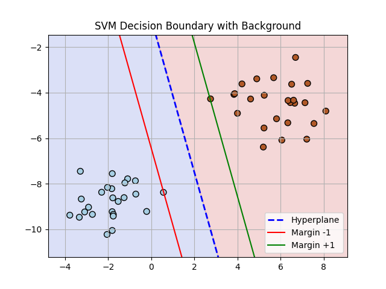

# Support Vector Machine (SVM) from Scratch

## What is Support Vector Machine (SVM)?

Support Vector Machine (SVM) is a supervised machine learning algorithm used for classification and regression tasks. It works by finding the optimal hyperplane that separates data points of different classes with the maximum margin. The data points that lie closest to the hyperplane and influence its position are called support vectors. SVM is particularly powerful in high-dimensional spaces and is effective even when the number of features is greater than the number of samples.

## Project Structure

This project consists of two Python files:

* `svm.py`: Implements the Support Vector Machine algorithm from scratch
* `train_test.py`: Loads synthetic data, trains the SVM model, evaluates it, and visualizes the decision boundary

---

## Step-by-Step Explanation

### `svm.py`

This file defines the `SVM` class, which implements a basic hard-margin SVM classifier:

1. **Initialization (`__init__`)**:

   * Creates placeholders for weights `w` and bias `b`.

2. **Fit method (`fit`)**:

   * Trains the model using brute-force grid search over possible weight and bias values.
   * Finds the hyperplane that correctly classifies all training points and maximizes the margin.
   * Stores the optimal `w` and `b` that meet the constraints.

3. **Predict method (`predict`)**:

   * Applies the decision function `sign(x . w + b)` to classify new data points.

### `train_test.py`

This file uses the `SVM` class to perform training and testing:

1. **Generate Data**:

   * Creates two clusters of 2D points with labels -1 and 1 using `sklearn.datasets.make_blobs()`.

2. **Train the SVM**:

   * Creates an instance of the `SVM` class and calls the `fit()` method on the training data.

3. **Evaluate Model**:

   * Uses `predict()` to classify all training samples.
   * Calculates and prints the accuracy score.

4. **Visualize Decision Boundary**:

   * A custom function `visualize_svm()` draws the hyperplane and margin lines.
   * Background regions are shaded to show decision zones.

---

## Code Comments Summary

* `fit()` function uses nested loops to iterate over weights and biases and checks if the margin constraints are satisfied.
* `predict()` function uses NumPy dot product to evaluate the decision function.
* `visualize_svm()` draws:

  * Dashed blue line: The decision boundary (hyperplane)
  * Red and green lines: Margins on either side of the hyperplane
  * Colored background: The class prediction regions

---

## Prediction Accuracy

The model achieves a prediction accuracy of:

```
Accuracy: 1.00
```

This means that every point in the training dataset is perfectly classified. This is expected in hard-margin SVM when the data is linearly separable, as it finds the perfect separator.

---

## Key Learning Outcomes

By implementing SVM from scratch, I learned:

* The theory and geometric intuition behind SVM
* How to formulate the margin maximization problem
* How support vectors determine the hyperplane
* How to visualize decision boundaries and margins
* Practical experience in building an ML algorithm from the ground up

---

## Visuals Explanation



The `svm.png` plot shows:

* Two distinct clusters of data, each labeled as a different class.
* A **blue dashed line** representing the SVM hyperplane that separates the classes.
* **Red** and **green** lines representing the margins (distance of +1 and -1 from the hyperplane).
* The **background is shaded** to indicate the decision region for each class: light blue for class -1 and light red for class +1.
* Each region corresponds to the side of the hyperplane where the model will predict that class.

This visualization confirms that the SVM has correctly learned the decision boundary and margins for the training data.

---

## Conclusion

This project helped me deeply understand how SVM works both theoretically and practically. Implementing it from scratch without relying on libraries taught me the inner mechanics of one of the most powerful classification algorithms in machine learning.
